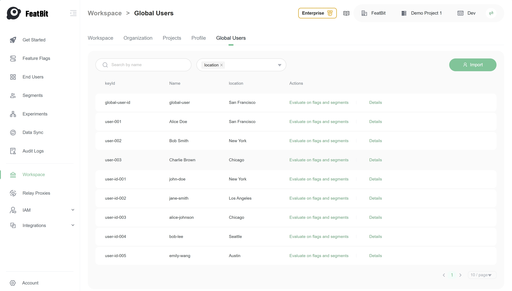
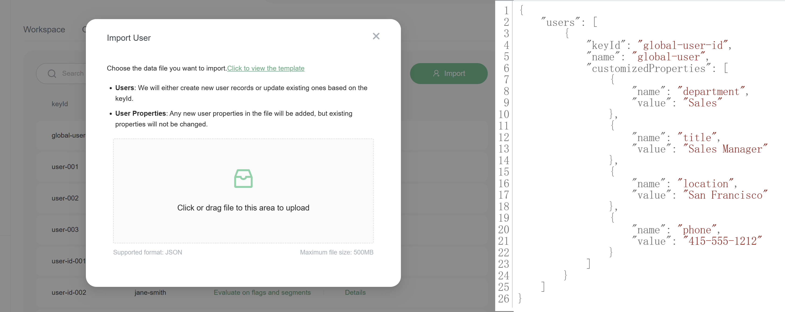
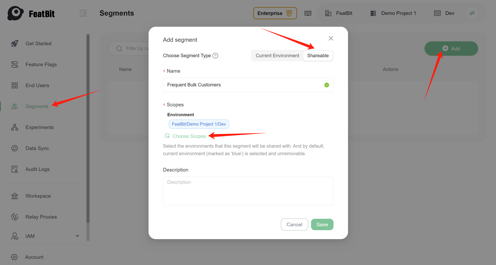
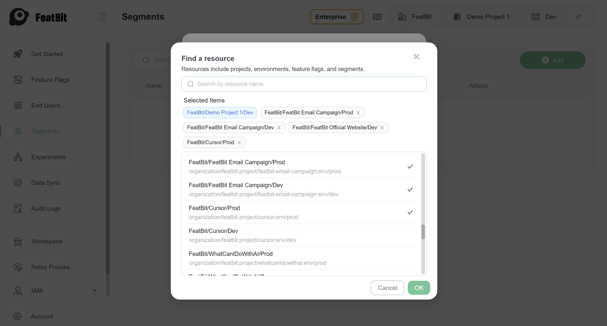
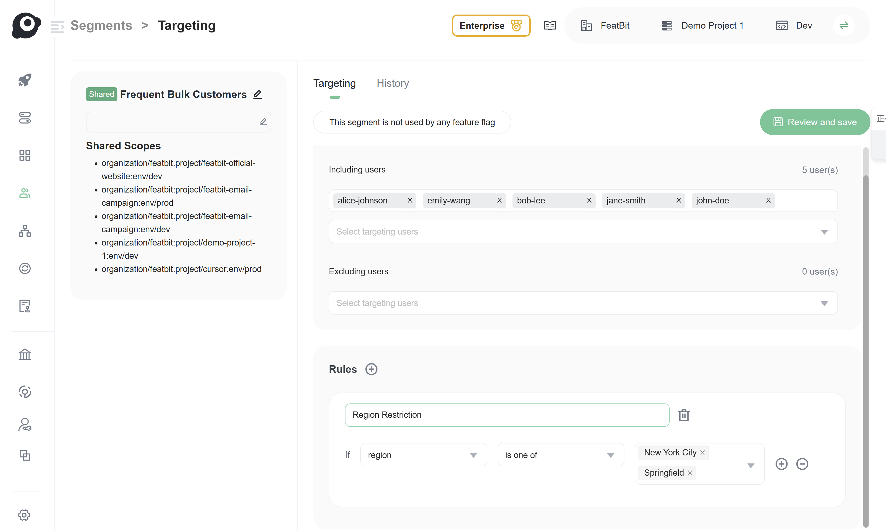
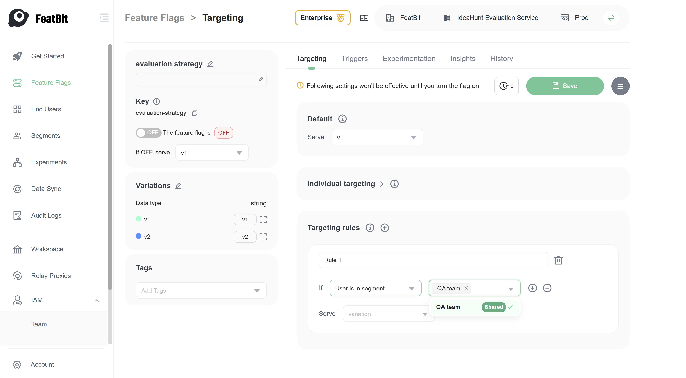

# Using Feature Flags Across the Entire Organization - Sharable Segments

**Prerequisites**: 
1. Readers should have a basic understanding of [feature flags](https://en.wikipedia.org/wiki/Feature_toggle).
2. Readers should have created a [feature flag](https://docs.featbit.co/getting-started/create-two-feature-flags) for release.

## Context

In medium- to large-sized companies, multiple projects can serve different purposes yet rely on the same internal teams and customer segments. 

For example, an online store may develop two initiatives targeting "Frequent Bulk Buyers": 

- A Bulk Buyer Express Checkout for quicker large orders 
- An Inventory Forecast & Auto-Replenishment feature to prevent stockouts. 

When releasing the features, both projects involve the:

- Same QA teams (familiar with bulk-buyer workflows) to test the features in production. 
- Same customer segment of Frequent Bulk Buyers as early rollout users for testing and providing feedback. 

This illustrates the concept of 'Same Audience, Different Projects,' effectively leveraging a shared customer segment to make feature flag release management more consistent and team-friendly.

[FeatBit, as an open-source feature flag service](https://www.featbit.co), not only helps projects release new features safely through testing in production and canary rollouts but also enables product and development teams to share the same customer segments for seamless target audience management.

## Practice

This section will show you how to use FeatBit to manage feature flags across the entire organization.

### Add global users

Global users are end-users defined in workspace (an organization level). It can be configured in the `Workspace` -> `Global Users` page.

Click 'Import' button to import global users from a json file.

### Add a sharable segment

You can add a sharable segment in any environment of a project. 

Switch to the `Segments` page, click `Add` button. Choose `Shareable` segment type.

Assign a name to the segment and define its environment scope. A sharable segment can be used from one environment within a project to multiple environments in other projects. You can also add whole organization as the scope of the sharable segment.

Click **OK** and **Save**.

### Add global users to the sharable segment

There is no difference between the [configuration of a normal segment](https://docs.featbit.co/feature-flags/users-and-user-segments/user-segments) and a sharable segment. You can add global users to a sharable segment in the same way you add environment-specific end-users to a normal segment. Additionally, you can define rules for a sharable segment just as you would for a normal segment.

### Use the sharable segment in a feature flag

In a feature flag configuration page, you can select the sharable segment as the target audience in a targeting rule. It has no difference from selecting a normal segment.

## Conclusion

FeatBit allows you to define global users and sharable segments in the workspace level, and use them in feature flags across the entire organization. This practice helps you manage feature flags more efficiently and ensures that the same feature is tested and released across different projects and environments.

That's all for this practice. If you have any questions, please feel free to contact us.

