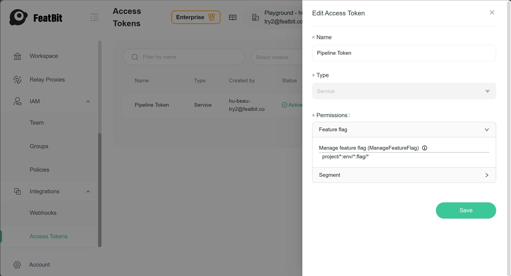
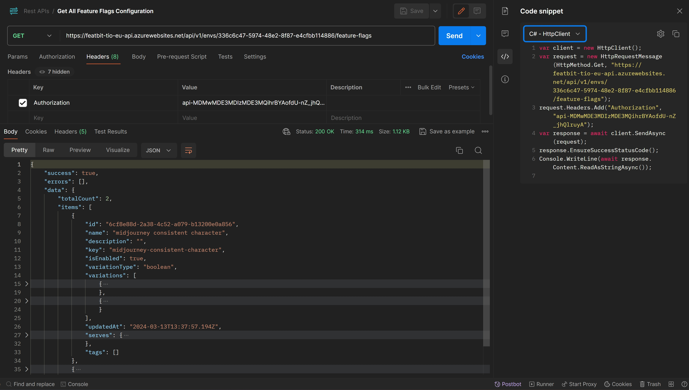

# Combining Feature Flags with Deployment Strategies to Optimize the Release Process - Ensuring Consistency between Code and Feature Flag Management System

Your team may deploy frequently per day or per week without fixed scheduled deployment date and time. Your team may also deploy once per bi-weekly or monthly with a fixed date and time. 

Regardless of the frequency, your team may make mistake to deploy a feature to production environment without creating it before deployment. This mistake may cause a production issue. To avoid this mistake, you can use a feature flag examination gate in the pipeline. 

Here're some points that you can check in the pipeline:

1. Check if some feature flags missed in current cd pipeline. "Miss" means for example:
   - The feature flag appears in the testing environment pipeline but not in the production environment pipeline.
   - The configuration of feature flag is not consistent between the testing environment pipeline and the production environment pipeline.
2. Check if your deployment pipeline adjusts with the product release plan defined by product/project managers.
   - Check if the new feature flag is disabled that won't expose new feature to public immediately after deployment. 
   - Check if the feature flag has configured schedule to enable or disable the feature.
3. Check if all feature flags appear in the code are defined in the feature flag management system.

In this article, we will discuss how to make features consistent across environments by using FeatBit step by step.


```

这里需要有张图，

Step 1: Check if some feature flags missed in current cd pipeline

Step 2: Adjust your Release Plan with your Deployment

Step 3: Check if all feature flags appear in the code are defined in the feature flag management system

```

## Check if some feature flags missed in current cd pipeline

This chapter will show you how to use FeatBit Rest APIs to get all feature flags in the two different environments and compare the feature flags in the two different environments. Here're the steps:

1. Create a API token to access FeatBit's Rest APIs.
2. Get all feature flags with the API token in the two different environments.
3. Compare the feature flags in the two different environments. 
   3.1 Method one, write your own program to compare the feature flags.
   3.2 Method two, use AI to compare the feature flags.
4. Compare the feature flags with the release plan.
   4.1 Method one, write your own program to compare the feature flags with the release plan.
   4.2 Method two, use AI to compare the feature flags with the release plan.

### Create a API token in FeatBit

1. Go to the FeatBit portal and login. Click on menu item **Access Token** under **Integration** to go to the access token page.
2. In "Access Token" page, click on the button "Add" to create a new access token, name it as "Pipeline Token".



3. Save the token in a secure place. You will not be able to see it again.

### Get all feature flags with the API token in the two different environments

You can use the API `https://{FeatBit API Service Url}/api/v1/envs/{envId}/feature-flags` to get all feature flags configuration in the testing environment. (For FeatBit Rest API, please check documentation [Using FeatBit REST API](https://docs.featbit.co/api-docs/using-featbit-rest-api))



As image shown below, you can use Postman to get all feature flags in one environment. For comparing, we need to call the API twice to get all feature flags in the two different environments.

### Check if feature flags between two environments are consistent

Once we got two sets of feature flags, we can compare them to see if they are consistent. We will compare:

1. If the feature flag key existed in one environment but not in the other.
2. If the feature flags in two environment of same key name have the same variation type and value.
3. If the configuration of each feature flag in two environments is consistent.

The first two points can be done by writing a program to compare the feature flags. You can alert a warning when the feature flag is missed in one environment. Human can check if it's a normal case or a mistake. 

Here's a sample code to compare the feature flags in two environments for the first two points:

```csharp
public async Task<EnvDiffReportModel> FindKeyAndVariationDiffAsync(EnvDiffParam param)
{
    var lastEnvFeatureFlags = await GetEnvFeatureFlagsAsync(param.LastEnvironmentId, param.AccessToken);
    var currentEnvFeatureFlags = await GetEnvFeatureFlagsAsync(param.CurrentEnvironmentId, param.AccessToken);

    var report = new EnvDiffReportModel() { Differences = [] };

    foreach (var lastFlag in lastEnvFeatureFlags)
    {
        var currentFlag = currentEnvFeatureFlags.FirstOrDefault(f => f.Key == lastFlag.Key);
        if (currentFlag == null)
        {
            report.Differences.Add($"Flag '{lastFlag.Key}' is missing in the current environment.");
        }
        else
        {
            var ave = AreVariationsEqual(lastFlag.Variations, currentFlag.Variations);
            if (ave.Item1 == false)
                report.Differences.Add($"Flag '{lastFlag.Key}': {ave.Item2}");
        }
    }

    return report;
}
```

You can find my sample code in my GitHub repository [here]().

After you call the API, you can get a report like this:

```json
{
  "differences": [
    "Flag 'welcom-notification-panel': Last Env has 3 variations, Current Env has 2 variations",
    "Flag 'vod' is missing in the current environment."
  ]
}
```

But when the variation type is JSON, you may need to consider the release plan. Because the feature flags in the different environment may have different configuration, and it's normal because of the strategy between testing and production is very different for marketing purpose.

The third point is various depends on the strategy. For example, the configuration in testing environment may already enabled the feature for testing purpose, but the configuration in production environment should be disabled. So in this case, we need to check your release plan to see if the configuration is consistent with the plan, see next chapter.

## Adjust your Release Plan with your Deployment.

To compare with the plan, today we can use AI to compare the feature flags with the release plan. The AI can help us to find out if the feature flags in the deployment pipeline are consistent with the release plan.


## Define default value when coding a feature flag

If the deployment piepline didn't discover potential risk, we propose also that when writing a new feature flag, define a default value. Normally we give it a default value of `false` to avoid the feature being enabled by mistake. Or other value that will not enable the new version or configuration of feature. 

## Check if all feature flags appear in the code are defined in the feature flag management system.

## Put your examination gate in the pipeline


