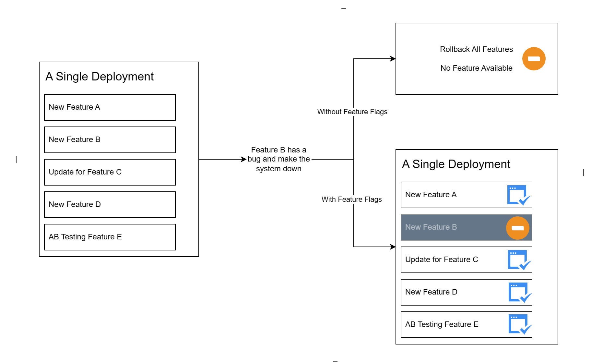
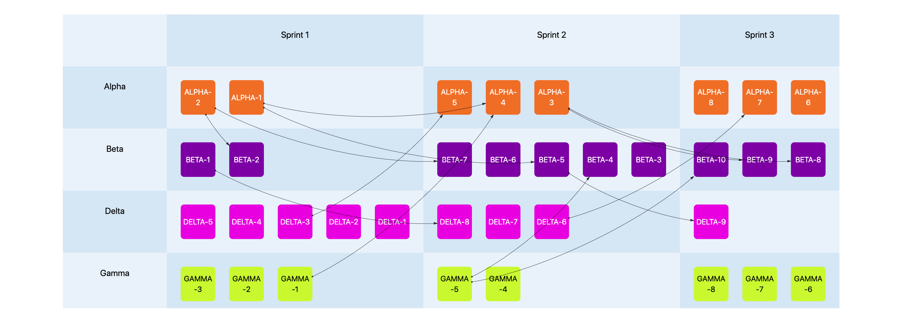

# Combining Feature Flags with Deployment Strategies to Optimize the Release Process - Release Plan

In the complex landscape of software development, a release plan serves as the guiding blueprint that navigates the journey from code creation to deployment. It encapsulates the strategic vision for delivering new features or updates and outlines the timeline, tasks, and dependencies involved in the process. Crucially, a release plan acts as a beacon, illuminating the path to successful project execution amidst the complexities of modern development environments.

This article explores why a release plan is necessary and why feature flags are a must-have technology in the release planning process.

## Why is a Release Plan Needed?

Within the software development process, a release plan is of paramount importance, much like a compass guiding sailors through treacherous waters. Not only does it provide a roadmap for developers, but it also serves as a linchpin for coordinating the efforts of diverse teams and managing the intricate web of dependencies inherent in modern software projects. As such, understanding the nuances of release planning and its integral role in the development lifecycle is essential to ensuring smooth and efficient project delivery. A release plan is indispensable in the software development process for several reasons:

- **Managing Complexity**: A release plan simplifies complex projects by breaking them into manageable tasks.
- **Coordinating Dependencies**: It ensures that interrelated components are updated in sync, minimizing compatibility issues.
- **Predictable Schedules**: By outlining task sequences and durations, it provides stakeholders with clear delivery timelines, building trust.
- **Risk Management**: Incorporating testing and contingency plans, it minimizes the impact of unexpected issues during releases.
- **Resource Allocation**: It helps efficiently assign human and technical resources based on task requirements and team capacity.
- **Alignment with Business Goals**: A release plan ensures that development efforts are in line with business objectives, maximizing value delivery.

## Who Should Create and Follow a Release Plan?

Creating and following a release plan is a collaborative effort that involves various stakeholders in different roles within the organization. Here's a breakdown of the key people involved:

- **Product managers**: Product managers play a central role in defining the strategic direction of the software product. They are responsible for understanding market needs, prioritizing features, and defining the release schedule based on business goals and customer requirements. Product managers often lead the creation of the release plan, working closely with other teams to ensure alignment with the product roadmap.
- **Project Managers**: Project managers are responsible for overseeing the execution of the release plan. They coordinate activities, allocate resources, and track progress to ensure that the plan is executed on schedule and within budget. Project managers work with cross-functional teams to identify dependencies, mitigate risks, and resolve issues that may arise during the release process.
- **Development team**: Developers are tasked with implementing the features and fixes outlined in the release plan. They work closely with product and project managers to understand requirements, estimate effort, and deliver high-quality code on time. Developers also contribute to refining the release plan by providing insights into technical feasibility, potential challenges, and alternative solutions.
- **Quality Assurance (QA) team**: The QA team is responsible for ensuring the quality and reliability of the software before it is released to customers. They collaborate with developers to define test cases, perform testing, and identify defects that need to be addressed before releasing to the large part of final end users/customers.
- **Operations Team**: Deploy and maintain software in production environments, providing insight into deployment strategies and infrastructure.
- **Stakeholders**: Provide feedback, prioritize features, and validate deliverables to ensure alignment with expectations and business goals.

## How Feature Flags Enhance the Release Planning Process

Release planning is a dynamic process that requires adaptability and flexibility to accommodate changing requirements and market conditions. Modern release plan usally includes many features and updates, and following today's DevOps practices, the release plan is often updated frequently:

- Multiple deployment per day or per week without fixed scheduled deployment date and time. 
- Deployment once per bi-weekly or monthly with a fixed date and time. 

Both deployment rythms may include a set of features and updates. In one single deployment, scheduled one may include many more features and updates than the frequent one. The release plan is not anymore only a plan for the deployment, but more for the new features and updates. Traditionnaly delivery method can't meet the challenges anymore, we need to introduce Feature Flags to the optimize the release plan and the deployment process.

When product manager or project manger design the release plan, they need to consider the risk management and coordination performance. So I highly recommend that the engineering team should also be involved in the release plan design process. They both need to understand the importance of feature flags in the release plan.

### Risk Management

Using [feature flags](https://www.featbit.co) to control the release and rollback of new features and updates reduces deployment risk. If a new feature causes problems in production, it can be quickly disabled without requiring a rollback. This minimizes the impact on users and reduces the urgency of fixing the problem, allowing the development team to address the issue without the pressure of an immediate fix.

Decoupling release from deployment allows you to decouple business risk from technical risk. A problem in the new feature won't affect the other problems in the same deployment. This is very helpful if

- We have a large deployment with many features and updates.
- We deploy frequently and can't test all features and updates at the same time.
- We deploy frequently and the team can't wait for the code change to fix the problem for previous deployments.
- We are migrating from one set of infrastructure to another.
- We are migrating from one database to another.
- When the deployment requires complex coordination of multiple teams.
- And so on.

Without [feature management](https://www.featbit.co/blogs/Free-and-Open-Source-Feature-Flag-Tools), any small risk can impact the entire release plan and turn the deployment process into a nightmare. Using a feature management system to decouple release from deployment can help minimize the impact of technical risk on business risk, because a single issue won't affect more than one point in the release plan.

I repeat the same thing in the previous paragraph. Because it's important for quick growth of the business.

### Managing Complexity & Coordinating Dependencies

The complexity of the release plan increases with the number of features and updates. The more features and updates, the more complex the release plan, especially if a feature requires coordination across multiple teams or multiple submodules. 

[Feature Flags](https://www.featbit.co) help reduce the complexity of the release plan by allowing teams to manage features and updates independently. This means that the release plan can be broken down into smaller, more manageable tasks, with each subtask or update developed, tested, and released independently of the others. This reduces the risk of interdependencies causing delays or problems in the release process.

For example, a new feature needs to be developed in Module A and Module B, and these modules are developed by two different teams. Module B needs to use an API in Module A. This can cause low delivery performance or delivery risk in these scenarios, such as

- The bug in module A may cause rollback of two modules. We should minimize the rollback scope to minimize the impact on end users.
- Each team's development schedule may be delayed by the other team, resulting in a long-lived branch and a high risk of merge conflict.
- The requirements may change during development. It could be a nightmare of collaboration between two teams, especially when the two teams have other tasks to do.
- And so on.

To avoid many potential low performance release plans, the team should introduce feature flags to decouple the dependencies. The release plan might look like this:

- Breakdown the feature into two sub tasks, one for module A and one for module B.
- Define well the data contract (such as API interfaces) between the two modules.
- Team A develops Module A, and using feature flags to doucple the release from deployment. Deploy when you want, but disable the feature.
- Team B develops Module B, and using feature flags to doucple the release from deployment. Deploy when you want, but disable the feature.
- Enable Module A and B for [testing feature toggles](https://www.featbit.co/blogs/Free-and-Open-Source-Feature-Flag-Tools) whenever they need to test the integration.
- Rollout the feature (includes Module A and B) progressively, then release to all end users when they're ready.
- Roll back immediately if there's a problem. You can rollback only to the end users who actually encounter the problem.

In practice, two modules may share the same feature flag. 

### Alignment with Business Goals & Predictable Schedules

Using a [feature management](https://www.featbit.co/blogs/Free-and-Open-Source-Feature-Flag-Tools) system allows non-engineering teams (product team, project managers, QA, marketing, sales, etc.) to align the release plan with business goals by controlling the visibility of new features and updates to specific user segments without engineering intervention.

Use cases such as targeted experimentation, marketing activities, trial allocation, entitlement management, etc., allow the business to validate new features and updates prior to a full release, ensuring that the release plan aligns with business objectives.

This accelerates the feedback loop and reduces the risk of releasing features that don't meet business objectives. Increase the productivity of team collaboration without engineering intervention.

## Conclusion

In conclusion, integrating feature flags into the release planning process enhances flexibility, reduces risk, and aligns development with business goals. This optimization streamlines the release process, fostering efficient collaboration and ensuring successful software deployments.