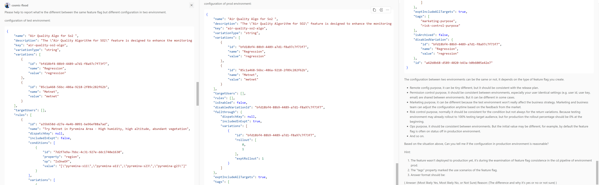

# Combining Feature Flags with Deployment Strategies to Optimize the Release Process - Making Features Consistent Across Environments

Your team can deploy frequently on a daily or weekly basis with no fixed deployment date and time. Your team may also deploy once every two weeks or once a month with a fixed date and time.

Regardless of the frequency, your team might make the mistake of deploying a feature to production without creating its feature flag prior to deployment. This mistake can cause a production problem. To avoid this mistake, you can use a feature flag review gate in the pipeline.

Here are some items you can check in the pipeline:

1. Check if some feature flags are missing in the current cd pipeline. For example, "missing" means
   - The feature flag appears in the test environment pipeline, but not in the production environment pipeline.
   - The configuration of the feature flag is not consistent between the test environment and the production environment.
2. Verify that your deployment pipeline aligns with the product release plan defined by the product/project managers.
   - Verify that the new feature flag that doesn't expose the new feature to the public immediately after deployment is disabled. 
   - Verify that the feature flag has a configured schedule for activating or deactivating the feature.
3. Verify that all feature flags appearing in the code are defined in the feature flag management system.


In this article, we will discuss how to make features consistent across environments (for points 1 and 2 above) by using FeatBits. In the next article, we will discuss how to check that all feature flags that appear in the code are defined in the feature flag management system.


## Check if some feature flags are missing in the current cd pipeline

This chapter will show you how to use FeatBit Rest APIs to get all feature flags in the two different environments and compare the feature flags in the two different environments. Here are the steps:

1. Create an API token to access FeatBit's Rest APIs.
2. Get all feature flags with the API token in the two different environments.
3. Compare the feature flags in the two different environments. 
   3.1 Method one, write your own program to compare feature flags.
   3.2 Method two, use AI to compare the feature flags.
4. Compare the feature flags to the release plan.
   4.1 Method one, write your own program to compare the feature flags to the release plan.
   4.2 Method two, use AI to compare the feature flags to the release plan.

### Creating an API Token in FeatBit

1. Go to the FeatBit portal and log in. Click on the **Access Token** menu item under **Integration** to go to the Access Token page.
2. On the **Access Token** page, click the **Add** button to create a new access token and name it "Pipeline Token".


3. Store the token in a safe place. You will not be able to see it again.

### Get all feature flags with the API token in the two different environments

You can use the API `https://{FeatBit API Service Url}/api/v1/envs/{envId}/feature-flags` to get all feature flags configuration in the testing environment. (For FeatBit Rest API, please check documentation [Using FeatBit REST API](https://docs.featbit.co/api-docs/using-featbit-rest-api))


As shown below, you can use Postman to get all feature flags in one environment. To compare, we need to call the API twice to get all the feature flags in the two different environments.

### Checking if feature flags are consistent between two environments

Once we have two sets of feature flags, we can compare them to see if they are consistent. We will compare:

1. Whether the feature flag key existed in one environment but not in the other.
2. If the feature flags in two environments with the same key name have the same variation type and value.
3. If the configuration of each feature flag is consistent in two environments.

The first two points can be accomplished by writing a program to compare the feature flags. You can generate an alert if the feature flag is missing in one environment. A human can check if it's a normal case or an error. 

Here's sample code to compare feature flags in two environments for the first two points:

```csharp
public async Task<EnvDiffReportModel> FindKeyAndVariationDiffAsync(EnvDiffParam param)
{
    var lastEnvFeatureFlags = await GetEnvFeatureFlagsAsync(param.LastEnvironmentId, param.AccessToken);
    var currentEnvFeatureFlags = await GetEnvFeatureFlagsAsync(param.CurrentEnvironmentId, param.AccessToken);

    var report = new EnvDiffReportModel() { Differences = [] };

    foreach (var lastFlag in lastEnvFeatureFlags)
    {
        var currentFlag = currentEnvFeatureFlags.FirstOrDefault(f => f.Key == lastFlag.Key);
        if (currentFlag == null)
        {
            report.Differences.Add($"Flag '{lastFlag.Key}' is missing in the current environment.");
        }
        else
        {
            var ave = AreVariationsEqual(lastFlag.Variations, currentFlag.Variations);
            if (ave.Item1 == false)
                report.Differences.Add($"Flag '{lastFlag.Key}': {ave.Item2}");
        }
    }

    return report;
}
```

You can find my sample code in my [**GitHub Repository Here**](https://github.com/featbit/featbit-samples/tree/main/samples/optimize-release-pipeline).

After calling the API, you can get a report like this:

```json
{
  "differences": [
    "Flag 'welcom-notification-panel': Last Env has 3 variations, Current Env has 2 variations",
    "Flag 'vod' is missing in the current environment."
  ]
}
```

But if the variation type is JSON, you may need to consider the release plan. Because the feature flags in the different environment may have different configuration, and it's normal because the strategy between testing and production is very different for marketing purpose.

The third point is different depending on the strategy. For example, the configuration in testing environment may already have the feature enabled for testing purpose, but the configuration in production environment should be disabled. So in this case we need to check your release plan to see if the configuration is consistent with the plan, see next chapter.

## Check feature flag configuration is consistent between environments.

The configuration between two environments can be the same or not, it depends on the type of feature flag you create.

- Remote config purpose, it can be tiny different, but it should be consistent with the release plan.
- Permission control purpose, it should be consistent between environments, especially your user identical settings (e.g. user id, user key, email) are shared between environments. But it can be different in some cases. 
- Marketing purpose, it can be different because the test environment won't really affect the business strategy. Marketing and business team can adjust the configuration anytime based on the feedback from the market.
- Risk control purpose, normally it should be consistent for the condition but not always for the return variations. Because testing environment may already rollout to 100% testing target audience, but for production the rollout percentage should be 0% at the beginning.
- Ops purpose, it should be consistent between environments. But the initial value may be different, for example, by default the feature flag is often on status off in production environment.
- And so on.

It's very difficult to check all this with a program. Because the configurations can be different for different purpose, different team habits and different project culture. Thanks to AI large language models, we can solve the difficulty by using prompt engineering. Here's an example of how we compared the configuration of a feature flag between test and production environments.

The image below shows the screenshot of the feature flag configuration in each environment.


> Description of Feature flag: The "Air Quality Algorithm for SO2" feature is designed to enhance the monitoring and analysis of sulfur dioxide (SO2) levels in the atmosphere. This feature employs advanced algorithms to process real-time data from various sources such as environmental sensors, satellites, and atmospheric models. By leveraging this feature, users can gain valuable insights into SO2 concentration levels, aiding in the assessment of air quality and potential environmental impacts. In the current system, we used regression method to do analysis. We now need to test new algo "Metnet" to get a better result for the SO2 of air quality. We will firstly test Metnet in some special region and environment, then expands to more situations.

Image below shows prompt that I tested with copilot. In the prompt, it contains:

1. Description for feature flag in each environment.
2. Feature flag configuration in json format in each environment.
3. The Prompt asking the AI to compare the feature flag's configuration in the two different environments based on the hint I mentioned above.
4. Some hints that can adjust the AI's understanding.

> You can use [FeatBit REST APIs](https://docs.featbit.co/api-docs/using-featbit-rest-api) to get feature flag's configuration details.



Then I got the answer in json format:

```json
{
    "Answer": "Most likely Yes",
    "Reason": "The configuration in the production environment seems reasonable given the context. The feature flag is not yet deployed to production, which is reflected in the 'isEnabled' field being set to false. This is a common practice to ensure that new features do not affect the production environment until they are fully tested and ready for deployment. The 'rules' array is empty in the production configuration, but the 'tags' property indicates that this feature flag is used for both marketing and risk control purposes, which makes sense as the feature is not yet deployed and thus no specific marketing rules are applied. The 'fallthrough' variations and 'disabledVariation' are the same in both environments, ensuring consistency. However, it's important to note that the final decision should be made based on the specific business requirements and deployment strategy."
}
```

> NOTE: In this article, we don't consider the release plan's influent with feature flag's configuration, it will be discussed in the next articles.

## Conclusion

In conclusion, ensuring consistency across environments is crucial for successful feature flag management. By utilizing FeatBit's Rest APIs and employing effective comparison methods, teams can identify discrepancies and align configurations. While automated checks offer efficiency, human oversight remains essential for nuanced decisions, considering business requirements and deployment strategies.

## Next

In the next few articles, we will discuss other things you can check in the pipeline, and give an example of how to integrate these checks into your GitHub action pipeline.

- Ensuring Consistency between Code and Feature Flag Management System
- Ensuring Feature Flags settings is Consistent with the Release Plan
- Include your check gate in the pipeline like Azure DevOps and GitHub actions.
- Define a default value when coding a feature flag


