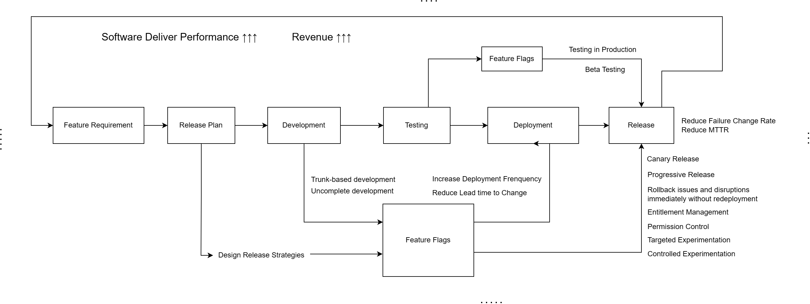

# Overview

In the fast-paced landscape of software development, optimizing the release process is paramount to ensuring smooth deployments, minimizing release risk and disruption, and maximizing delivery value. Traditional methods often fall short of meeting these challenges, so modern approaches are needed. In this series of practical articles, "Combining Feature Flags with Deployment Strategies to Optimize the Release Process," we explore the transformative potential of integrating feature flags with deployment strategies. By using these tools together, development teams can navigate the complexities of software releases with agility and precision. Let's explore how this synergy can revolutionize the way we deliver software and deliver value to users.

- [Introduction of "Combining Feature Flags with Deployment Strategies to Optimize the Release Process"](https://www.featbit.co/blogs/Combining-Feature-Flags-with-Deployment-Strategies-to-Optimize-the-Release-Process)

- [Release Plan](https://www.featbit.co/blogs/Combining-Feature-Flags-with-Deployment-Strategies-to-Optimize-the-Release-Process-Part-2)

- [Making Features Consistent Across Environments](https://www.featbit.co/blogs/Combining-Feature-Flags-with-Deployment-Strategies-to-Optimize-the-Release-Process-Part-3)

The above article is in the works, so stay tuned!

- Ensuring Consistency between Code and Feature Flag Management System
- Ensuring Feature Flags settings is Consistent with the Release Plan
- Include your check gate in the pipeline like Azure DevOps and GitHub actions.
- Define a default value when coding a feature flag

- 

- [Ensuring Good Execution of Release Plan]()

- [Measuring your Delivery Performance]()