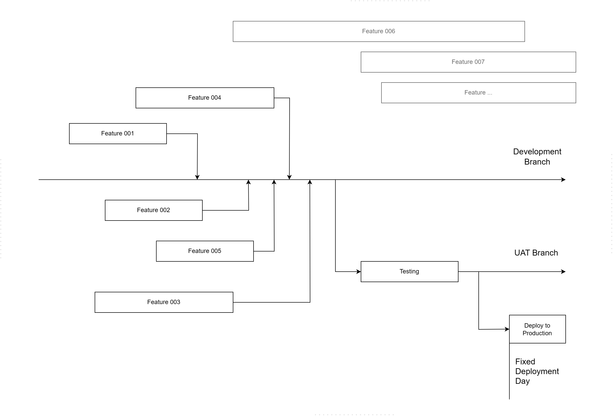
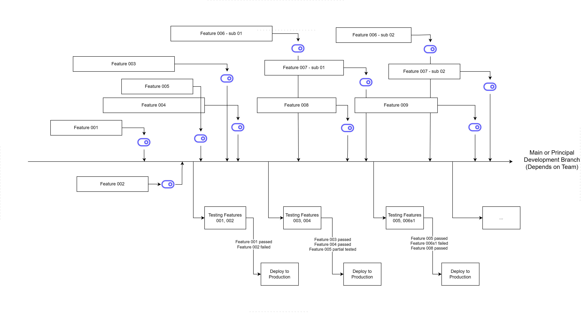

# How to Use Feature Flags to Increase Deployment Frequency

Deployment frequency is one of the key metrics that DORA (DevOps Research and Assessment) uses to measure software delivery performance. Many feature flag vendors will tell you that feature flags can significantly increase deployment frequency. But how? Here, I will give you a step-by-step guide on how to use feature flags to increase deployment frequency.

**Prerequisites**: 
1. Readers should have a working understanding of [continuous delivery](https://en.wikipedia.org/wiki/Continuous_delivery).
2. Readers should have a basic understanding of [feature flags](https://en.wikipedia.org/wiki/Feature_toggle).

## Why we need to deploy frequently.

It's all about "Money". The more frequently you deploy, the earlier you can deliver value to the customer. The earlier you deliver value to the customer, the earlier you can get feedback from the customer. The earlier you get feedback from the customer, the earlier you can adjust your product to meet the customer's needs. The earlier you adjust your product to meet the customer's needs, the more money you can make.

The delivery value gap isn't too big for each deployment, but it's a huge gap if you accumulate it over time. **If you can't deploy frequently as what your competitors do, you will be out of the game**. 

## Understanding what prevents us from deploying frequently

**Fear of deployment risks**. The more frequently you deploy, the more likely it is that failures will occur. Each failure increases your fear, leading to less frequent deployments. Why does failure cause more fear?

- Failure can impact customer experience, cause customer churn, then revenue loss.
- Rollback, fix and re-deploy will take more time and exhaust the team.

**Big story or big feature**. Many teams wouldn't break the big story into small pieces. They think the big story is a whole, and they can't deploy it until it's all done.

## What we may have done wrong and thought wrong.

Your team may set a fixed deployment day for each iteration. They merge some features into the main branch (or main development branch, it depends on the team), then do as much testing as possible before the deployment day. During the testing period, no new features are allowed to be merged (and even no development is allowed).

It's considered a compromised way to keep the release safe. But the bugs will still happen in production, and unmerged feature branches can become long-lived feature branches. There's a better way to make the delivery safer and allow you to ship more features in an iteration.

 more features in an iteration.

Why do we need to break the big story into small pieces? Because one big story can introduce a long-lived feature branch that carries a high risk of code conflict, review, and testing. If you have many of them, it will be a nightmare for the team. You may think it's technically difficult to break the big story into small pieces and merge them into the main code without breaking the existing service. [Feature flags](https://www.featbit.co) can help you to solve this problem.

## Feature flags solve the problem

The main key to solving this problem is to **decouple the feature release from the deployment**. This means that you can deploy the feature to UAT, SIT, or production, but don't release it immediately. You can test the feature after deployment, and then release it when it's ready.

When you do release the feature, the feature flag allows you to release the feature in a more secure manner:

1. Involve related teams (such as QA, Products) to test the feature online (in uat, sit, production or a production-like environment).
2. Enable the feature flag for a small group of users (such as 10% of end users), and then monitor the feature's performance.
3. Gradually roll out the feature to more users (20%, 50%, 80%...) until all users can use the feature without any problems.

If you encounter a bug during the feature rollout, you can immediately roll back or disable the feature without having to redeploy the service. The other features won't be affected, and you can fix the bug in a more relaxed way.

So you can change the deployment process in a Zen and safer way:

The image above shows the game-changing deployment process with feature flags.

- You can merge a feature into the main branch after feature development is complete. Whenever a UAT deployment request is submitted, you can immediately deploy new features to the UAT environment. By default, new features are disabled.
- You can enable the feature flag to enable the new features in the UAT environment, and then test the new features.
  - If the feature is OK, do nothing.
  - If the feature has a bug, report the bug, disable the feature without code changing and redeploy, then do nothing.
- Whenever a prod deployment request is submitted, you can deploy to a prod immediately. New features are disabled by default.
- Release the features individually in the production environment, as mentioned earlier in this chapter.

## How to implement feature flags

This article doesn't cover how to implement feature flags in your service. But I can give you some advice:

- Choose an [open source feature flags](https://featbit.co/blogs/Free-and-Open-Source-Feature-Flag-Tools) service, like [Featbit](https://www.featbit.co).
- Select the SDKs that support your service. For example if your team use .NET tech stacks to develop the service, you might consider using [.NET Feature Flags](https://www.featbit.co/feature-flag-csharp) SDKs.
- Follow the documentation of the feature flags service, and implement the feature flags in your service.

## Conclusion

Feature flags can help you to increase the deployment frequency. It's not only a technical solution, but also a cultural change. It's a good way to make the delivery safer and faster.
