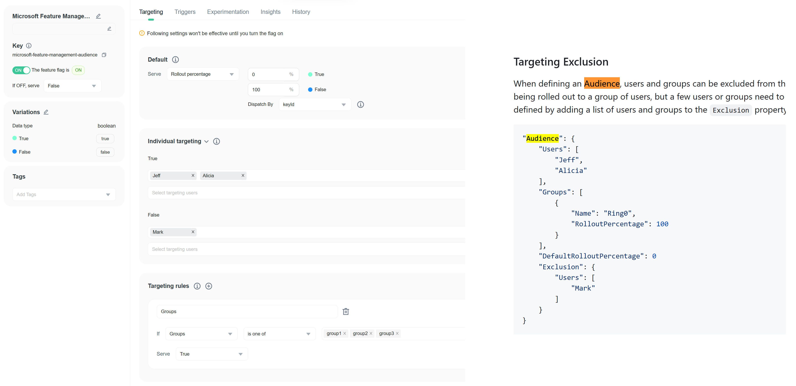

import { Callout } from 'nextra/components'

# Microsoft Feature Management Custom Feature Provider

[Microsof.FeatureManagement](https://github.com/microsoft/FeatureManagement-Dotnet) is a feature flag library that allows you to control the availability of features in your .NET application. Along with Azure App Configuration service, it provides a way to separate feature rollout from code deployment, allows you to turn features on and off without redeploying new code. This can be useful for testing in production, canary releases, targeting rollout and A/B testing.

## Why custom feature provider

Many teams don't use Azure App Configuration (AAC) service for feature management. Because of:

- Performance limitations, AAC has a limit rate of requests per second and can't support high traffic applications.
- Technical limitations, AAC doesn't support all programming languages and frameworks, but only .NET, Java.
- Vendor lock-in, AAC is a Microsoft service, so you can't use it in other cloud providers or in on-premises environments.
- User friendly limitations, AAC is azure resource based unit, you need to create a new resources for each environment and project.
- And so on.

We need to enable the Microsoft.FeatureManagement library to work with other feature flag providers. In this article, I will show you how to create a custom feature provider for the Microsoft.FeatureManagement library.

## Two methods to implement a custom feature provider

There are 2 methods to create a custom feature provider for the Microsoft.FeatureManagement library:

1. Using the existing JSON configuration format and built-in feature filters. You need to convert the 3rd party feature flag configuration format to the Microsoft.FeatureManagement configuration format.
2. [Recommended] Use `IFeatureFilter` or `IContextualFeatureFilter` to evaluate custom feature flag configurations. You need to write your own logic to evaluate the feature flag with a custom configuration format.

Custom Feature Providers and built-in Feature Providers can also be used together. You can use FeatureFilters to evaluate a custom feature flag service, and use built-in Feature Providers to create a feature flag service based on an existing feature flag service.

```json
"MyFeature": {
    "EnabledFor": [
        {
            "Name": "FeatBitCriteria", // Custom Feature Filter Alias for Custom Feature Provider
        },
        {
            "Name": "Microsoft.Percentage",
            "Parameters": {
                "Value": 50
            }
        }
    ]
}
```


## Method 1: Convert from custom configuration to Microsoft.FeatureManagement's configuration

Here's an example: FeatBit (an [open-source feature flags](https://www.featbit.co/blogs/Free-and-Open-Source-Feature-Flag-Tools) service built with .NET) has a different configuration format from Microsoft.FeatureManagement. The two services are not 100% compatible with each other. For example:

- FeatBit can have multiple variants for a feature flag, while Microsoft.FeatureManagement only supports boolean values.
- FeatBit allows multiple customized rule conditions, whereas Microsoft.FeatureManagement only supports a few built-in rule conditions.
- Microsoft.FeatureManagement supports recurrence schedules, but FeatBit does not support this feature.
- And so on.



Therefore, you need to find a compromise to convert your custom feature flag's configuration to Microsoft.FeatureManagement's configuration, such as:

- Only supporting boolean values for feature flags.
- Mapping the custom rule conditions to Microsoft.FeatureManagement's built-in rule conditions.
- Ignoring the recurrence schedule.
- And so on.

Below is a simplified sample of FeatBit's feature flag configuration:


```json
{
    ...
    "key": "featureflagname",
    "variationType": "boolean",
    "variations": [
        {
            ...
            "value": "true"
        },
        {
            ...
            "value": "false"
        }
    ],
    ...
    "rules": [
        {
            "id": "8ee2951d-a121-47d6-b7d0-b33cf633a2ff",
            "name": "Groups",
            ...
            "conditions": [
                {
                    "id": "4c37d50d-81cb-4caa-b3b3-fa91bd80f431",
                    "property": "Groups",
                    "op": "IsOneOf",
                    "value": ["group1"]
                }
            ],
            "variations": [
                {
                    "id": "201909b4-0c7f-4fec-92da-9980f648e2be",
                    "rollout": [
                        0,
                        1
                    ],
                    "exptRollout": 1
                }
            ]
        }
    ],
    ...
}
```

Below is a Microsoft.FeatureManagement's configuration format:

```json
"featureflagname": {
    "EnabledFor": [
        {
            "Name": "Microsoft.Targeting",
            "Parameters": {
                "Audience": {
                    ...
                    "Groups": [
                        {
                            "Name": "group1",
                            "RolloutPercentage": 100
                        },
                    ],
                    ...
                }
            }
        }
    ]
}
```

To convert FeatBit's feature flag configuration to Microsoft.FeatureManagement's configuration, you need to implement the `IFeatureDefinitionProvider` interface and complete the `GetAllFeatureDefinitionsAsync` and `GetFeatureDefinitionAsync` methods. In the `GetAllFeatureDefinitionsAsync` method:

1. Get feature flags from the FeatBit service.
2. Convert each feature flag's configuration from FeatBit to Microsoft.FeatureManagement's feature flag configuration.
3. Return the converted feature flag configurations.

```csharp
public class FeatBitFeatureDefinitionProvider : IFeatureDefinitionProvider
{
    private readonly IFbClient _fbClient;
    private IEnumerable<FeatureDefinition> _definitions;

    public FeatBitFeatureDefinitionProvider(IFbClient fbClient)
    {
        _fbClient = fbClient;
        _definitions = Array.Empty<FeatureDefinition>();
    }

#pragma warning disable CS1998 // Async method lacks 'await' operators and will run synchronously
    public async IAsyncEnumerable<FeatureDefinition> GetAllFeatureDefinitionsAsync()
#pragma warning restore CS1998 // Async method lacks 'await' operators and will run synchronously
    {
        // get feature flags from FeatBit
        var flags = _fbClient.AllFlags();

        // convert FeatBit's feature flags to Microsoft.FeatureManagement's feature flag configuration
        _definitions = flags.Select(x => x.ToFeatureDefinition());

        foreach (var definition in _definitions)
        {
            yield return definition;
        }
    }

    public Task<FeatureDefinition> GetFeatureDefinitionAsync(string featureName)
    {
        var feature = _definitions.FirstOrDefault(x => x.Name == featureName);
        return Task.FromResult(feature!);
    }
}
```

Then initialize the Microsoft Feature Management's custom provider `FeatBitFeatureDefinitionProvider` in the `Program.cs` file:

```csharp
...

services.AddSingleton<IFbClient, FbClient>();
services.AddSingleton<IFeatureDefinitionProvider, FeatBitFeatureDefinitionProvider>()
        .AddFeatureManagement();

...
```

## Method 2 [Recommended]: Use IFeatureFilter or IContextualFeatureFilter to evaluate custom feature flag configurations

Instead of converting your custom feature flag configuration to Microsoft.FeatureManagement's configuration, you can keep the original configuration format and use `IFeatureFilter` or `IContextualFeatureFilter` to override the built-in feature flag evaluation logic. Here, I will use FeatBit as the custom feature provider and `IFeatureFilter` to evaluate the feature flag.

First, we need to implement `IFeatureDefinitionProvider` and complete the `GetAllFeatureDefinitionsAsync` method. The difference from Method 1 is that you can define your own feature flag configuration format instead of using the built-in one. The code below shows an example of how to implement `IFeatureDefinitionProvider` with FeatBit's feature flag service.


```csharp
public class FeatBitFeatureDefinitionProvider : IFeatureDefinitionProvider
{
    private readonly IFbClient _fbClient;
    private IEnumerable<FeatureDefinition> _definitions;
    public FeatBitFeatureDefinitionProvider(IFbClient fbClient)
    {
        _fbClient = fbClient;
        _definitions = Array.Empty<FeatureDefinition>();
    }
#pragma warning disable CS1998 // Async method lacks 'await' operators and will run synchronously
    public async IAsyncEnumerable<FeatureDefinition> GetAllFeatureDefinitionsAsync()
#pragma warning restore CS1998 // Async method lacks 'await' operators and will run synchronously
    {
        // get feature flags from FeatBit
        var flags = _fbClient.AllFlags();
        _definitions = flags.Select(x => new FeatureDefinition
        {
            Name = x.Key,
            EnabledFor = new List<FeatureFilterConfiguration>
            {
                new()
                {
                    // FeatBit feature filter's name
                    Name = "FeatBit",
                    // Parameters = x.ToFeatureDefinition()
                }
            }
        });
        foreach (var definition in _definitions)
        {
            yield return definition;
        }
    }

    public Task<FeatureDefinition> GetFeatureDefinitionAsync(string featureName)
    {
        var feature = _definitions.FirstOrDefault(x => x.Name == featureName);
        return Task.FromResult(feature!);
    }
}
```

The code above shows:

1. Retrieving feature flags from the FeatBit service using `_fbClient.AllFlags()`. `_fbClient` is an instance of the FeatBit client and is passed to the constructor through dependency injection.
2. Converting each feature flag's configuration to a `FeatureDefinition` object.
3. Indicating the FeatureFilter `FeatBit` as the only filter for the feature flag evaluation in the `EnabledFor` array.
4. Not assigning the FeatBit's feature flag configuration to Parameters, because we have a smarter way.

Next, we initialize the custom feature filter `FeatBitFilter` in the `Program.cs` file:


```csharp
builder.Services.AddSingleton<IFeatureDefinitionProvider, FeatBitFeatureDefinitionProvider>()
        .AddFeatureManagement()
        .AddFeatureFilter<FeatBitFilter>();
```

Now, we need to create the FeatBit feature filter to evaluate the feature flag with the custom configuration format. The `FeatBitFilter` class implements the `IFeatureFilter` interface and overrides the `EvaluateAsync` method. The `EvaluateAsync` method should return a boolean value to indicate whether the feature is enabled or not.

```csharp
[FilterAlias("FeatBit")]
public class FeatBitFilter : IFeatureFilter
{
    private readonly IFbClient _fbClient;
    public FeatBitFilter(IFbClient fbClient)
    {
        _fbClient = fbClient;
    }
    public Task<bool> EvaluateAsync(FeatureFilterEvaluationContext context)
    {
        var isEnabled = _fbClient.BoolVariation(context.FeatureName, defaultValue: false);
        return Task.FromResult(isEnabled);
    }
}
```

Here's the smart approach. In the `EvaluateAsync` method, we use the `BoolVariation` method of the FeatBit client to get the feature flag's value, instead of writing complicated conversion logic. Since `_fbClient` is a singleton instance of the FeatBit client and is passed to the constructor through dependency injection, it contains the feature flag's configuration and evaluation logic. Therefore, we don't need to perform the conversion in the `FeatBitFeatureDefinitionProvider` class.

## Enrich your feature flag service by combining two methods

In the `GetAllFeatureDefinitionsAsync` method, you can call multiple feature flag services to get feature flag configurations. For example, you can retrieve the feature flag configuration from the Azure App Configuration service and use the built-in feature filter to evaluate the feature flag. You can also retrieve the feature flag configuration from the FeatBit service and implement the `IFeatureFilter` to evaluate the feature flag. This allows you to use the Microsoft.FeatureManagement library with other feature flag providers.


```json
"FeatureA": {
    "EnabledFor": [
        {
            "Name": "Microsoft.Percentage",
            "Parameters": {
                "Value": 50
            }
        }
    ]
},
"FeatureB": {
    "EnabledFor": [
        {
            "Name": "FeatBit", // Feature Filter Alias name
        }
    ]
}
```


## Conclusion

In this article, I showed you how to create a custom feature provider for the Microsoft.FeatureManagement library. You can use the built-in feature filter to create a custom feature flag service or use `IFeatureFilter` or `IContextualFeatureFilter` to evaluate custom feature flag configurations.

You can also combine the two methods to create a feature flag service based on both existing and custom feature flag services. This allows you to use the Microsoft.FeatureManagement library with other feature flag providers.