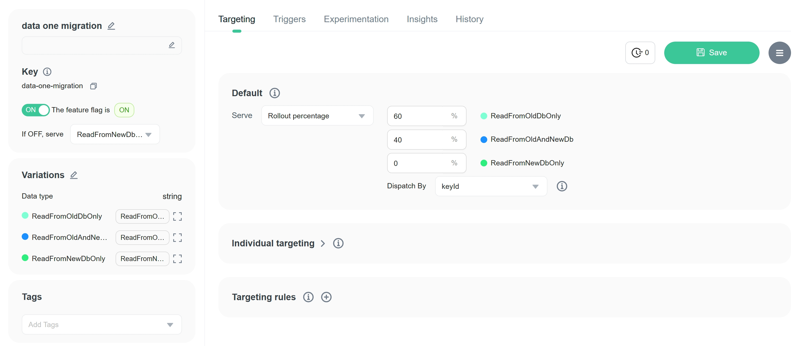

import { Callout } from 'nextra/components'

# Testing Feature Toggles with xUnit

## Introduction

Feature Flags (or Feature Toggles) are widely used in software development to enable safer and more frequent feature delivery. We often write a feature flag into a code method and then use this flag to control the method's execution. For example:

```csharp
public DataModel ReadDataOneAsync(string id)
{
    if(_featureFlags.IsEnabled("new-data-store-migration"))
    {
        DataItem data = _noSqlRepo.Get(id);
        return new DataModel(data);
    }
    else
    {
        DataItem data = _sqlRepo.Get(id);
        return new DataModel(data);
    }
}
```

In the example above, the `ReadDataOneAsync` method retrieves data from either a NoSQL database or a SQL database based on the value of the new-data-store-migration feature flag. If the flag is enabled, the method runs the code to retrieve data from the NoSQL database; otherwise, it runs the code to retrieve data from the SQL database.

You may have already written a unit test for retrieving data from the SQL database. However, with the introduction of the feature flag and a new code path (retrieving from the new NoSQL database), you need to revise the unit test to cover all scenarios.

Here, I will show you a .NET example of how to unit test a method that includes [feature flags](https://www.featbit.co). We will use xUnit as the testing framework.

## Scenario Context - Data Migration

Imagine we have an SQL database where we store complex order data in some tables. As the data grows, the performance of the SQL database deteriorates. For this reason, among others, we decide to migrate the order data to a NoSQL database to enhance performance.

To avoid unexpected downtime and ensure the new data store functions as expected, we opt for an incremental migration. This involves testing the migration in production and gradually migrating the data using a dual-write/dual-read methodology.

We use a feature flag to control the data migration. Suppose we've already tested the migration process for writing data. The code below provides a more detailed example of the `ReadDataOneAsync` method (for reading data) mentioned earlier:

```csharp
// Method to be unit tested
public async Task<OneModel?> ReadDataOneAsync(string id)
{
    // function for retriving data (name is one) from sql database
    var f1 = async () =>
    {
        var one = await _oneRepository.GetByIdAsync(id);
        return one == null ? null : new OneModel()
        {
            Id = one.Id
        };
    };
    // function for retriving data (name is one) from noSql database
    var f2 = async () =>
    {
        var one = await _oneNoSqlRepository.GetByIdAsync(id);
        return one == null ? null : new OneModel()
        {
            Id = one.Id
        };
    };
    // function for comparing the result of two functions above
    Action<OneModel?, OneModel?> aCompare = (r1, r2) =>
    {
        if(r2 == null)
        {
            _logger.LogError($"Read One item in NoSql Database Failed");
        }
        if(r1?.Id != r2?.Id)
        {
            _logger.LogError($"Item in noSql Database doesn't equal to Item in sql databse");
        }
    };
    // executing the migration process
    return await FbDbMigration<OneModel?>.MigrateAsync(f1, f2, _fbClient, "data-one-migration", aCompare);
}
```

```csharp
// Method which is used to control the migration process
public async static Task<T> MigrateAsync(
    Func<Task<T>> a1, Func<Task<T>> a2, IFbClient fbClient, 
    string ffKey, Action<T, T> compare, int timeOut = 10000)
{
    var migrationState = fbClient.MigrationState(ffKey);
    if (migrationState == FeatBitMigrationEnum.ReadFromOldDbOnly)
        return await Task.Run<T>(a1);
    else if (migrationState == FeatBitMigrationEnum.ReadFromNewDbOnly)
        return await Task.Run<T>(a2);
    else
    {
        using var cts = new CancellationTokenSource();
        
        var t1 = Task.Run<T>(a1);

        cts.CancelAfter(timeOut);
        var t2 = Task.Run<T>(a2, cts.Token);

        var parallelTasks = await Task.WhenAll<T>(t1, t2);
        compare(parallelTasks[0], parallelTasks[1]);

        return parallelTasks[0];
    }
}

// extension of FbClient to evaluate migration feature flag value
public static FeatBitMigrationEnum MigrationState(this IFbClient fb, string featureFlagKey, string defaultValue = "")
{
    var migStr = fb.StringVariation(featureFlagKey, FbUser.Builder($"transit-{new Guid()}").Build(), defaultValue);
    return migStr switch
    {
        "ReadFromOldDbOnly" => FeatBitMigrationEnum.ReadFromOldDbOnly,
        "ReadFromOldAndNewDb" => FeatBitMigrationEnum.ReadFromOldAndNewDb,
        "ReadFromNewDbOnly" => FeatBitMigrationEnum.ReadFromNewDbOnly,
        _ => FeatBitMigrationEnum.ReadFromOldDbOnly
    };
}
```

In the code above, you will see the feature flag `data-one-migration` includes 3 variations: `ReadFromOldDbOnly`, `ReadFromNewDbOnly`, and `ReadFromBothDbs`. When the feature flag is set to:

- `ReadFromOldDbOnly`, the method reads data from the SQL database. 
- `ReadFromNewDbOnly`, the method reads data from the NoSQL database. 
- `ReadFromBothDbs`, the method reads data from both databases and compares the results.

<Callout type="info" emoji="👾">
  This set of feature flag variations for the migration is widely used in the migration process.
</Callout>

When reading data from both databases, if the data from the NoSQL database differs from the data in the SQL database, the method logs an error message. Alternatively, if the execution time for reading data from both databases exceeds the timeout, the method returns the default value.

<Callout type="info" emoji="ℹ️">
  To make the example more straightforward, I've omitted the other exception handling code.
</Callout>

The migration transition process will be:

1. Initially, the feature flag is set to `ReadFromOldDbOnly`.
2. We will progressively set the feature flag to `ReadFromBothDbs` until we are confident that the data in the NoSQL database is consistent with the data in the SQL database.



3. Then we will progressively set the feature flag to `ReadFromNewDbOnly` until no data is read from the SQL database.
4. We will remove the feature flag and the code that reads data from the SQL database.

In the unit test, we should aim to cover all scenarios of the `ReadDataOneAsync` method. We will use xUnit to write the unit test.

## Use xUnit to test all code paths

In the `ReadDataOneAsync` method, we used three injected services:

- `_oneRepository`, a repository that is responsible for reading data from the SQL database.
- `_oneNoSqlRepository`, a repository that is responsible for reading data from the NoSQL database.
- `_fbClient`, FeatBit feature flag serivce.
- `_logger`, a logger service.

We need to mock these services and the logger to test the method. We use [Moq](https://github.com/devlooped/moq) to mock the services and the logger.

In the unit test, we need to cover three code path for different feature flag variations, I use `CombinatorialData` to generate test cases. Please watch the code below and read the comments carefully to understand the test cases.

```csharp
[Theory, CombinatorialData]
public async void ReadDataOneAsyncTest(
    // Use `CombinatorialData` to set the unit test cases. This unit test 
    // will execute three times, each time with a different feature flag value.
    [CombinatorialValues("ReadFromOldDbOnly", "ReadFromNewDbOnly", "ReadFromOldAndNewDb")]string ffValue,
    [CombinatorialValues("not-important")] string oneId)
{
    // Use `Mock.Setup` to mock the `IFbClient` service and set the return value for the `StringVariation` method.
    var mockFbClient = new Mock<IFbClient>();
    mockFbClient.Setup(fb => fb.StringVariation("data-one-migration", It.IsAny<FbUser>(), "")).Returns(ffValue);

    // Use `Mock.Setup` to mock the `IOneNoSqlRepository` and `IOneRepository` services and set the return value for the `GetByIdAsync` method.
    var mockNoSqlRepo = new Mock<IOneNoSqlRepository>();
    mockNoSqlRepo.Setup(r => r.GetByIdAsync(oneId)).ReturnsAsync(new OneNoSql() { Id = oneId });

    var mockSqlRepo = new Mock<IOneRepository>();
    mockSqlRepo.Setup(r => r.GetByIdAsync(oneId)).ReturnsAsync(new One() { Id = oneId });

    // Mock a logger service
    using ILoggerFactory factory = LoggerFactory.Create(builder => builder.AddConsole());
    ILogger<DataService> logger = factory.CreateLogger<DataService>();

    var ds = new DataService(logger, mockSqlRepo.Object, mockNoSqlRepo.Object, mockFbClient.Object);
    var ro = await ds.ReadDataOneAsync(oneId);

    Assert.Equal(oneId, ro?.Id);
}
```

As shown in the code above:

- Use `CombinatorialData` to set the unit test cases. This unit test will execute three times, each time with a different feature flag value: `ReadFromOldDbOnly`, `ReadFromNewDbOnly`, and `ReadFromBothDbs`. 
- Use `Mock.Setup` to mock the `IFbClient` service and set the return value for the `StringVariation` method.
- Use `Mock.Setup` to mock the `IOneNoSqlRepository` and `IOneRepository` services and set the return values for their respective `GetByIdAsync` methods.


After running (or debugging) the test, you will see the testing results below. The test method has been run three times.


<Callout type="default">
    The objective of this code is to demonstrate how to test a method that includes  feature flags. The code is not perfect; it may lack test cases or not good look code. Please feel free to point out any flaws and help us improve the article.
</Callout>


## Code Source

The feature flag code and service mentioned above use the FeatBit service and [FeatBit's .NET server SDK](https://github.com/featbit/featbit-dotnet-sdk). You can visit their [official website](https://www.featbit.co) and [GitHub repository](https://github.com/featbit/featbit) for more information.

The code demonstrated in the article is also available in [FeatBit's sample project](https://github.com/featbit/featbit-samples/tree/main/samples/unitest).